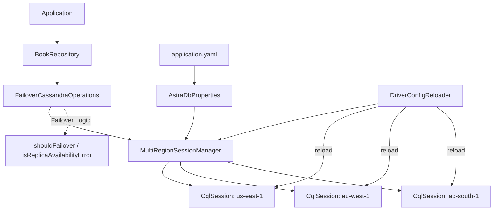

# Multi-Region Astra DB Failover Plan

## Top-Level Overview

**Goal**: Enable application-level cross-region failover for Spring Data Cassandra repositories against Astra DB by managing multiple `CqlSession` instances (one per region, each with its own secure connect bundle) and implementing retry logic inspired by the driver's `CrossDatacenterFailover.java` example.

**Scope**:
- Support N regions (minimum 2: primary + standby)
- Each region has its own secure connect bundle; the application token is shared across all regions
- Automatic primary region detection from bundle metadata, with `ASTRA_PRIMARY_REGION` env var override
- Application-level retry: try primary session → on specific errors (unavailable, timeout, no nodes), retry on standby session(s)
- Only `CqlSession` is multi-region aware; repositories use `CassandraOperations` which delegates to the active session

**Approach**: 
1. Extend configuration to support multiple region bundles
2. Create a `MultiRegionSessionManager` that holds all sessions and tracks the active one
3. Implement a `FailoverCassandraOperations` wrapper that delegates to the active session and handles failover retry logic
4. Replace the single `CqlSession` bean with the manager, and the auto-configured `CassandraOperations` with the failover wrapper

---

## Sub-Tasks
### Context
```
- JDK25 is available at /Users/madhavan.sridharan/Documents/Data/05_tools/jdk/jdk-25.0.2.jdk/Contents/Home//bin/java
- Full Cassandra Java Driver code is available at /Users/madhavan.sridharan/Documents/Data/03_coderepos/cassandra-java-driver and refer to 4.19.3 tag/release.
- APPLICATION_TOKEN is same for the given Astra DB cluster. No need to repeat it under each region.
```

### 1. Extend AstraDbProperties for Multi-Region Configuration

**Intent**: Support multiple region-specific secure connect bundles and tokens in configuration, with dynamic primary region detection.

**Expected Outcomes**:
- `AstraDbProperties` supports a map of region → bundle/token
- Primary region auto-detected from bundle metadata (keyspace/datacenter name in bundle)
- `ASTRA_PRIMARY_REGION` env var can override detection
- Backward compatible: single `astra.db.*` properties still work for single-region deployments

**Todo List**:
- ✅ Modify `AstraDbProperties` to accept `Map<String, RegionConfig>` where `RegionConfig` contains `secureConnectBundle` and optional `displayName`; `applicationToken` is top-level (shared across all regions)
- ✅ Add `primaryRegion` property (nullable, defaults to auto-detect)
- ✅ Add utility method to parse bundle metadata for region detection (read `datacenter.json` from bundle ZIP)
- ✅ Update `application.yaml` with example multi-region configuration
- ✅ Ensure backward compatibility: if only `astra.db.*` (non-map) is set, treat as single region "default"

**Relevant Context**:
- `AstraDbProperties.java` (current single-region record)
- `application.yaml` (current `astra.db` section)
- Secure connect bundle structure: contains `datacenter.json` with datacenter name

---

### 2. Create MultiRegionSessionManager Bean

**Intent**: Centralized management of multiple `CqlSession` instances, active session tracking, and health monitoring.

**Expected Outcomes**:
- Spring bean `MultiRegionSessionManager` with:
  - `Map<String, CqlSession> sessions` (region → session)
  - `String activeRegion` (current primary)
  - `CqlSession getActiveSession()` — returns current active session
  - `void failoverTo(String region)` — switches active region, logs transition
  - `List<String> getAvailableRegions()` — regions with healthy sessions
  - `boolean isHealthy(String region)` — lightweight health check (simple query)
  - **Micrometer metrics**: `astradb.session.healthy{region}`, `astradb.failover.active_region`
- **Eager initialization**: All sessions created at startup (`@PostConstruct`)
- Primary region auto-selected or overridden via env var
- Proper lifecycle: all sessions closed on shutdown (`@PreDestroy`)
- Standby sessions use minimal pool: `advanced.connection.pool.remote.size=1`

**Todo List**:
- ✅ Create `MultiRegionSessionManager` class in `astra` package
- ✅ Implement session creation per region using secure connect bundle + shared top-level token
- ✅ Configure standby sessions with `pool.remote.size=1` via execution profile
- ✅ Implement active region selection logic (env var override → explicit config → auto-detect from bundle → first key)
- ✅ Add `@PostConstruct` to initialize all sessions eagerly
- ✅ Add `@PreDestroy` to close all sessions
- ✅ Add health check method (execute `SELECT now() FROM system.local` with short timeout)
- ✅ Add failover method that validates target region is healthy before switching
- ✅ Expose Micrometer metrics: active region gauge, per-region health gauges
- ✅ Expose metrics/info via `toString()` for logging/actuator

**Relevant Context**:
- `AstraCassandraConfiguration.java` (current `CqlSessionBuilderCustomizer` bean)
- `DriverConfigLoader` setup (reusable per session)
- `AstraSessionFactoryFactoryBean` (uses session for schema creation)
- Micrometer `MeterRegistry` for metrics registration

---

### 3. Implement FailoverCassandraOperations Wrapper

**Intent**: Wrap `CassandraOperations` to delegate to the active session and implement application-level failover retry logic.

**Expected Outcomes**:
- `FailoverCassandraOperations` implements `CassandraOperations` interface
- Delegates all operations to `MultiRegionSessionManager.getActiveSession()` via a `CassandraTemplate` internally
- On specific exceptions (mapped from driver's `shouldFailover` logic), automatically retries on next available region
- **Failover exceptions**: `NoNodeAvailableException`, `AllNodesFailedException` (with replica availability errors), `DriverTimeoutException`, `CoordinatorException` (with replica availability errors)
- **Non-failover exceptions**: Propagate immediately (syntax errors, auth failures, etc.)
- **LWT operations**: **Failover only on total DC outage (`NoNodeAvailableException`)** — detect LWT options; on other failover exceptions (timeout, replica unavailable), propagate original exception. Only `NoNodeAvailableException` triggers retry on standby.
- **Consistency level**: Writes stay `LOCAL_QUORUM`; reads use configured `astra.failover.read-consistency` (default `LOCAL_QUORUM`, optional `LOCAL_ONE`)
- **Prepared statements**: Transparent re-prepare on `UnpreparedException` after failover
- **Configurable max failover attempts** (default: number of configured regions - 1)
- **Micrometer metrics**: `astradb.failover.total`, `astradb.failover.latency`
- Logs each failover attempt with region and error details

**Todo List**:
- ✅ Create `FailoverCassandraOperations` class implementing `CassandraOperations`
- ✅ Inject `MultiRegionSessionManager`, `CassandraConverter`, `MeterRegistry`
- ✅ Create internal `CassandraTemplate` per region (lazy via `ConcurrentHashMap`)
- ✅ Implement `execute(Statement)` with failover retry loop
- ✅ Implement `shouldFailover(Throwable)` method mirroring `CrossDatacenterFailover.java` logic
- ✅ Implement `isReplicaAvailabilityError(Throwable)` helper
- ✅ Implement `isLwtOperation(InsertOptions/UpdateOptions/DeleteOptions)` detector
- ✅ In `shouldFailover`: for LWT operations, only return true for `NoNodeAvailableException` (total DC outage)
- ✅ Delegate all `CassandraOperations` methods to internal template with failover wrapper
- ✅ Handle `InsertOptions`, `UpdateOptions`, `DeleteOptions`, `QueryOptions` correctly across failover
- ✅ Add configuration for `maxFailoverAttempts` and `failoverReadConsistency` (default `LOCAL_QUORUM`)
- ✅ Driver auto-reprepares on the same session; `UnpreparedException` is not thrown by driver 4.x — cross-session prepared statement cache is session-local and handled transparently
- ✅ Expose Micrometer metrics: failover counter, failover latency timer

**Relevant Context**:
- `BookRepositoryCustomImpl.java` (uses `CassandraOperations` for LWT/partial updates)
- `CrossDatacenterFailover.java` (`shouldFailover`, `isReplicaAvailabilityError` methods)
- `AstraSessionFactoryFactoryBean` (creates schema using admin template)
- Micrometer `MeterRegistry` for metrics registration

---

### 4. Update AstraCassandraConfiguration for Multi-Region

**Intent**: Replace single-session beans with multi-region equivalents while preserving schema creation and config reloading.

**Expected Outcomes**:
- `MultiRegionSessionManager` bean replaces `CqlSessionBuilderCustomizer` + `cassandraDriverConfigLoader`
- `FailoverCassandraOperations` bean replaces auto-configured `CassandraOperations`/`CassandraTemplate`
- `AstraSessionFactoryFactoryBean` uses active session for schema creation (runs once at startup on primary)
- `DriverConfigReloader` reloads config for all sessions (or just active session)
- Schema action (`create_if_not_exists`) runs on primary region only at startup

**Todo List**:
- ✅ Remove `astraSessionBuilderCustomizer` bean (single session customizer)
- ✅ Remove `cassandraDriverConfigLoader` bean (single config loader)
- ✅ Add `multiRegionSessionManager` bean (creates all sessions with per-region config loader)
- ✅ Add `cassandraOperations` bean (`@Primary FailoverCassandraOperations`)
- ✅ Update `cassandraSessionFactory` to use `multiRegionSessionManager.getActiveSession()`
- ✅ Update `DriverConfigReloader` to trigger reload on all sessions in manager
- ✅ `AstraSchemaCreator` runs on primary region session (via `getActiveSession()` at startup)

**Relevant Context**:
- `AstraCassandraConfiguration.java` (all current beans)
- `DriverConfigReloader.java` (reloads config on file change)
- `SpringEnvironmentDriverConfigSupplier.java` (builds driver config from Spring Environment)

---

### 5. Add Configuration Properties & Documentation

**Intent**: Make multi-region configuration discoverable and documented.

**Expected Outcomes**:
- Updated `application.yaml` with multi-region example including failover config
- Configuration properties metadata (via `spring-boot-configuration-processor`) for IDE support
- Clear documentation in README or separate config guide

**Todo List**:
- ✅ Update `application.yaml` with commented multi-region example (token at top level, only bundle per region):
  ```yaml
  astra:
    db:
      application-token: ${ASTRA_DB_APPLICATION_TOKEN:}  # shared across all regions
      primary-region: us-east-1  # optional, auto-detected if not set
      regions:
        us-east-1:
          secure-connect-bundle: ${ASTRA_DB_BUNDLE_USEAST1:}
        eu-west-1:
          secure-connect-bundle: ${ASTRA_DB_BUNDLE_EUWEST1:}
      failover:
        max-attempts: 0              # 0 = try all remaining regions (default)
        read-consistency: LOCAL_QUORUM  # LOCAL_QUORUM or LOCAL_ONE (writes always LOCAL_QUORUM)
        enabled: true                # master switch
  ```
- ✅ `FailoverProperties` nested record registered via `spring-boot-configuration-processor` (already on classpath)
- ✅ Document failover behavior, consistency level, LWT no-failover, region selection — in `README.md` sections 9 & 10

**Relevant Context**:
- `application.yaml` (current structure)
- `AstraDbProperties.java` (to be modified with nested `FailoverProperties` record)

---

### 6. Testing & Validation

**Intent**: Verify multi-region failover works correctly.

**Expected Outcomes**:
- Unit tests for `MultiRegionSessionManager` (mock sessions, test failover logic, health checks, metrics)
- Unit tests for `FailoverCassandraOperations` (mock exceptions, verify retry behavior, LWT no-failover, prepared statement re-prepare, consistency level handling)
- Integration test profile (requires 2+ Astra regions) - optional, manual
- Demo runner shows failover in action (simulated or real)

**Todo List**:
- ✅ Add `MultiRegionSessionManagerTests` — session creation, active region switching, health checks, Micrometer gauge values (19 tests)
- ✅ Add `FailoverCassandraOperationsTests` — `shouldFailover` logic for all exception types, LWT boundary enforcement, option detection, metrics registration (32 tests)
- ⬜ Update `BookDemoRunner` to demonstrate failover (optional: simulate failure)
- ✅ Schema creation verified: `cassandraSessionFactory` uses `getActiveSession()` (primary at startup)
- ✅ Config hot-reload verified: `DriverConfigReloader` iterates all sessions via `MultiRegionSessionManager.getSessions()`
- ✅ Micrometer metrics exposed via Actuator `/actuator/metrics`; documented in `README.md` section 10

**Relevant Context**:
- `BookDemoRunner.java` (demo walkthrough)
- Existing test classes in `astra/` and `book/` test packages
- Micrometer `MeterRegistry` for metric verification in tests

---

## Architecture Diagram



---

## Key Design Decisions

| Decision | Rationale |
|----------|-----------|
| Application-level failover (not driver `dc-failover`) | Astra uses separate bundles per region; driver `dc-failover` requires single cluster metadata |
| Wrap `CassandraOperations` not replace `CqlSession` bean | Repositories and Spring Data internals expect `CassandraOperations`; single bean swap minimizes impact |
| **Failover keeps `LOCAL_QUORUM` for writes; reads configurable (`LOCAL_QUORUM` default, `LOCAL_ONE` optional)** | Astra enforces `LOCAL_QUORUM` minimum for writes; reads can downgrade. Configurable via `astra.failover.read-consistency` |
| Primary region auto-detected from bundle | Avoids manual config; bundle's `datacenter.json` contains the region name |
| Schema creation on primary only | Astra keyspaces are global; tables/indexes replicated; no need to run DDL on every region |
| Health check via `SELECT now() FROM system.local` | Lightweight, validates connectivity and auth |
| **Eager session initialization (all regions at startup)** | Instant failover, proactive health checks; minimal memory (~15MB/region) with `pool.remote.size=1` |
| **LWT operations: failover only on total DC outage (`NoNodeAvailableException`)** | Paxos is DC-local; failover on partial failure risks duplicates/stale reads. Total DC outage = LWT couldn't have committed, so retry on standby is safe |
| **Prepared statements: transparent re-prepare on failover** | Each session has own cache; catch `UnpreparedException` and re-prepare |
| **Metrics exposed via Micrometer** | Negligible overhead (<1KB, <1μs/failover); enables alerting, dashboards, SLO tracking |

---

## Resolved Design Questions

1. **Consistency level on failover**: **Writes stay `LOCAL_QUORUM` (Astra-enforced); reads configurable** — default `LOCAL_QUORUM`, optional `LOCAL_ONE` via `astra.failover.read-consistency`.
2. **Prepared statement caching**: **Transparent re-prepare on failover** — catch `UnpreparedException`, re-prepare on new session.
3. **LWT behavior**: **Failover only on total DC outage (`NoNodeAvailableException`)** — Paxos is DC-local; failover on partial failure (timeout, replica unavailable) risks duplicates/stale reads. Total DC outage = LWT couldn't have committed, so retry on standby is safe.
4. **Session initialization**: **Eager (all regions at startup)** — instant failover, proactive health checks; minimal memory with `pool.remote.size=1`.
5. **Metrics/observability**: **Yes, expose via Micrometer** — negligible overhead (<1KB, <1μs/failover); gauges for active region/session health, counters for failover total, timer for failover latency.

---

## Implementation Order

1. **AstraDbProperties** (foundation)
2. **MultiRegionSessionManager** (core infrastructure)
3. **FailoverCassandraOperations** (failover logic)
4. **AstraCassandraConfiguration** (wire it all together)
5. **Configuration & Documentation**
6. **Tests**

Each step builds on the previous. Steps 1-4 are required for basic functionality; 5-6 are for production readiness.